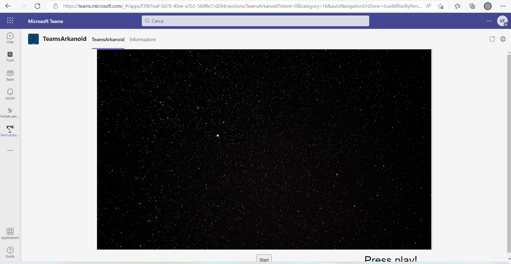

# teams-arkanoid

## Summary

Simple experiment to take a Typescript Arkanoid version inside SPFx. The TypeScript source code belongs to @weibenfalk https://github.com/weibenfalk/typescript-arkanoid.
The solution is hosted in SharePoint Online and can be added as personal app, meetingSidePanel, meetingDetailsTab.

## Used SharePoint Framework Version

## Applies to

- [SharePoint Framework](https://aka.ms/spfx)
- [Microsoft 365 tenant](https://docs.microsoft.com/en-us/sharepoint/dev/spfx/set-up-your-developer-tenant)

> Get your own free development tenant by subscribing to [Microsoft 365 developer program](http://aka.ms/o365devprogram)

## Prerequisites

## Solution

Solution|Author(s)
--------|---------
teams_arkanoid |  [Valerio Frau](https://github.com/Frau87/)

## Version history

| Version | Date             | Comments        |
| ------- | ---------------- | --------------- |
| 1.0.8   | October 23, 2022 | Initial release |

## Disclaimer

**THIS CODE IS PROVIDED _AS IS_ WITHOUT WARRANTY OF ANY KIND, EITHER EXPRESS OR IMPLIED, INCLUDING ANY IMPLIED WARRANTIES OF FITNESS FOR A PARTICULAR PURPOSE, MERCHANTABILITY, OR NON-INFRINGEMENT.**

---

## Minimal Path to Awesome

* Clone this repository
* in the command line run:
  * restore dependencies: `npm install`
  * build solution `gulp build --ship`
  * bundle solution: `gulp bundle --ship`
  * package solution: `gulp package-solution --ship`
  * locate solution at `.\sharepoint\solution\teams-arkanoid.sppkg` 
  * upload it to your tenant app catalog
  * deploy to all site collection
  * sync to teams (from appcatalog)

## Features

Just a simple game. Enjoy!

> Share your web part with others through Microsoft 365 Patterns and Practices program to get visibility and exposure. More details on the community, open-source projects and other activities from http://aka.ms/m365pnp.

## Next Steps
* UI color according to MS Teams
* Responsive interface

## References

- [Getting started with SharePoint Framework](https://docs.microsoft.com/en-us/sharepoint/dev/spfx/set-up-your-developer-tenant)
- [Building for Microsoft teams](https://docs.microsoft.com/en-us/sharepoint/dev/spfx/build-for-teams-overview)
- [Use Microsoft Graph in your solution](https://docs.microsoft.com/en-us/sharepoint/dev/spfx/web-parts/get-started/using-microsoft-graph-apis)
- [Publish SharePoint Framework applications to the Marketplace](https://docs.microsoft.com/en-us/sharepoint/dev/spfx/publish-to-marketplace-overview)
- [Microsoft 365 Patterns and Practices](https://aka.ms/m365pnp) - Guidance, tooling, samples and open-source controls for your Microsoft 365 development
